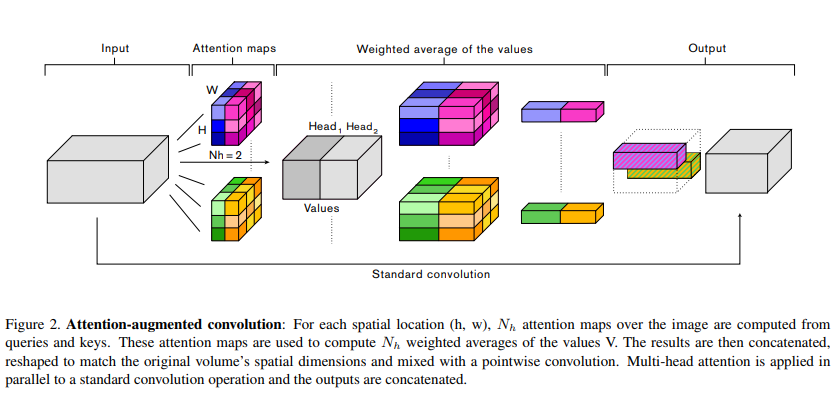
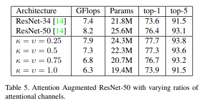

## Attention-Augmented Convolution
The tensorflow implementation from the paper [Attention Augmented Convolutional Networks](https://arxiv.org/pdf/1904.09925v1.pdf). Will add a Pytorch implementation of the same soon but currently the torch.einsum is [very slow](https://github.com/pytorch/pytorch/issues/10661), even on GPU it is slower than Numpy.



To use the layer:
```
from layer import augmented_conv2d
```
The paper has shows promising results, especially below:


